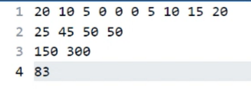
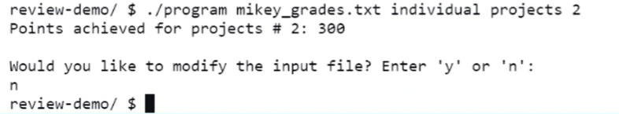

CSC 212 Review Project: Grade Book Developed by Amber Rastella, Giorgio Florentino, Junsheng Wu, and Michael Tedeschi

<b>Summary:</b> 
This project was built in order to keep track of our grades for URI's CSC 212 course as the semester progresses. Over the span of 2 weeks, our group has worked diligently to prepare this program. The program follows the <i>points-achieved grading system</i> that the course uses. We utilized a variety of good programming principles in order to build this project, including a <code>class</code> structure, various <code>while</code> and <code>for</code> loops, thoughtful class-method implemenetations, vectors, file processing functions, and conditional logic. Overall, it was a good review of many C++ concepts that leaves us with a useful program to keep us informed of our grade as the semester progresses.
  
<b>Feature list:</b>
<ul>
 <li>View individual grades for a particular categorical assignment (<i>e.g.</i> if the user wants to see their grade for Lab #7)</li>
 <li>View categorical total along with each individual grade achieved for that category</li>
 <li>3 functions that provide different perspectives on the overall course achievement:
  <ol><li><b>Complete overview:</b> all individual grades, categorical totals, and overall points achieved</li>
   <li>Categorical totals and overall points achieved</li>
   <li>Overall points achieved</li>
  </ol>
 <li>Ability to modify the grades input file after a function. This allows for experimenting with different scenarios
</ul>
 
<b>Planning:</b>
Our Planning Phase consisted of several meetings: an in-person to write the pseudocode document and get familiar with the project requirements, and then we organized a Discord server and text group chat for further communications. Our initial thought process was to parse command line arguments to determine what the user wanted to do, and then call the appropriate functions to calculate & display that data. We also decided on an input file format -- it is a structured text file that the program knows how to read. Each grade value is separated by a space. Since we follow a points-achieved system, the maximum value for each individual grade entry is as follows:
 <table align="center">
 <tr>
  <th>Category Name</th>
  <th>Maximum Individual Points Possible</th>
 </tr>
 <tr>
  <td>Lab</td>
  <td>20 points</td>
 </tr>
 <tr>
  <td>Assignments</td>
  <td>50 points</td>
 </tr>
 <tr>
  <td>Projects</td>
  <td>1st project: 150 points 2nd project: 350 points</td>
 </tr>
 <tr>
  <td>Final Exam</td>
  <td>100 points</td>
 </tr>
 </table>
 Therefore, a student with a perfect score would have an input .txt file as such: 
 <code>20 20 20 20 20 20 20 20 20 20
 50 50 50 50
 150 350
 100</code> 
 We constructed <code>read_file</code> and <code>modify_file</code> functions that would allow for file parsing and writing. This is how we populate our grade-containing vectors. We also developed functions to perform specific jobs -- typically each feature has a respective calculation function & print function. The exception was for the course features, as the user has 3 options for how they would like to view their course grade. This was built out as a menu allowing the user to select a choice, and then calling the appropriate calculation functions and printing the results. Finally we implemented a main driver method for our class called <code>initialize</code>, which parses the command-line arguments that it receives in order to figure out what to do. This achieves full encapsulation and allows us the ability to create either 1 <code>Grade_Book</code> in the main function, or many!
   
 <b>Compilation Instructions:</b>
 <ul><li>The following command will compile the program using G++: <code>g++ main.cpp gradebook.cpp -o programName</code></li></ul>
  
  
 <b>Runtime Instructions:</b>
 <ol>
 <li>Ensure the executable and the input file are in the same directory</li>
 <li>Execute the program with the appropriate command-line arguments:</li>
 <table align="center">
  <tr>
   <th>Execution Format</th>
   <th>Description</th>
  </tr>
  <tr>
   <td style="white-space: no-wrap;"><code>./programName sampleInput.txt individual (labs/assignments/projects/exam) [assignment number]</code></td>
    <td>Displays an individual grade from a given category Assignment Number can be left out if requesting 'exam'</td>
  </tr>
  <tr>
   <td style="white-space: no-wrap;"><code>./programName sampleInput.txt category (labs/assignments/projects/exam)</code></td>
   <td>Displays each individual grade from a category, and the overall category grade</td>
  </tr>
  <tr>
   <td style="white-space: no-wrap;"><code>./programName sampleInput.txt course</code></td>
   <td>Displays the course functions menu, allowing the user to choose how they want to see the overall course grade</td>
  </tr>
 </table>
<li>After displaying results, the user is repeatedly prompted if they'd like to modify any grades</li>
 </ol>
  
 <b>Sample Input/Output Screenshots:</b>
  
 <table>
  <tr>
   <th>Sample Input File</th>
   <th>Sample Execution + Outputt</th>
   <th>Explanation</th>
  </tr>
  <tr>
   <td></td>
   <td></td>
   <td>Calling the <code>individual</code> function and requesting Project #2's grade. The output is 300. (See line 3, grade 2 of input)</td>
  </tr>
 </table>

